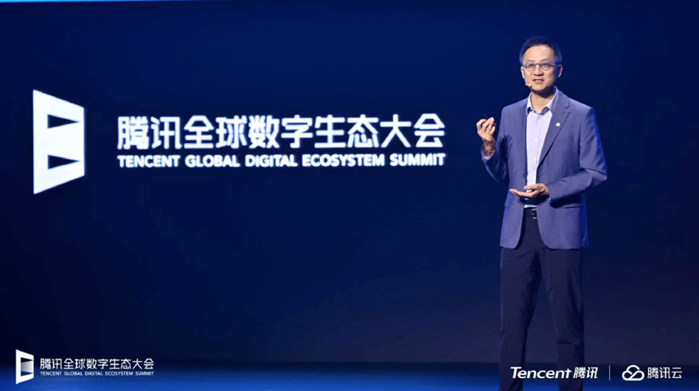
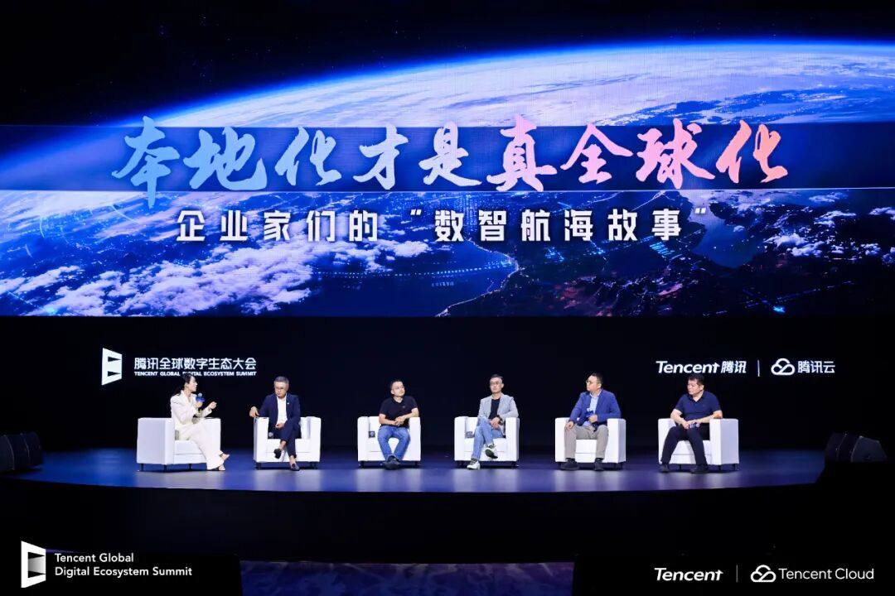

# 2025腾讯云国际出海峰会：国际业务高双位数增长，海外客户规模同比增长翻倍

> 公众号: 腾讯云出海服务
> 发布时间: 2025-09-17 19:10
> 原文链接: https://mp.weixin.qq.com/s/qlFNIGSkt5H5Kw-u7_6bDg

---

9月16日，2025腾讯全球数字生态大会国际出海峰会在深圳国际会展中心召开。来自全球多个国家和地区的企业代表、行业专家聚焦全球数字化进程，共同探讨国际市场机遇与数字化转型实践，分享一线实战经验，探讨把握智能技术机遇实现效率升级的新可能。

腾讯集团高级执行副总裁、云与智慧产业事业群CEO汤道生在致辞中提到，“向智能化要产业效率，向全球化要收入规模”，已经成为企业增长的两大核心动力。腾讯将打造“智能化”与“全球化”两大效率引擎，助力企业稳健和可持续增长。

腾讯云也在峰会期间公布了国际化业务的最新进展：产品全面拥抱国际化，完成多项产品和功能升级，全面适配全球技术生态。过去3年，腾讯云国际业务持续高双位数增长，90%以上的互联网企业、95%以上的头部游戏公司出海都选择了腾讯云。

**全球产业力量齐聚，共议AI+云新机遇**

在国际出海峰会上，Converge ICT、DANA、阿联酋电信e& UAE、香港赛马会、富融银行、GoTo 集团、Indosat Ooredoo Hutchison (IOH)、Miniclip、三菱日联银行（中国）、Prosus、True IDC等海外企业代表共同探讨了企业该如何用云服务和领先的 AI 技术推动下阶段增长等议题、分享了和腾讯云合作过程中的实践和感受。

面向国际市场，腾讯云以创新应用链接全球，打造了诸多“尖刀”产品，正不断将技术实力转化为客户价值。例如腾讯云智能体开发平台（ADP）面向全球发布3.0版，在3个月内完成了近600项需求的开发，持续迭代LLM+RAG、Workflow、Multi-Agent等多种智能体开发框架，帮助企业结合专属数据，高效搭建稳定、安全、契合业务需求的智能体。目前，腾讯云的超级应用解决方案（TCSAS）、刷掌服务平台（PalmAI Service） 等产品也已获得亚太、中东、美洲等地区海外企业的广泛认可与采用。

腾讯云国际高级副总裁杨宝树表示：“腾讯云正把在海量场景中沉淀的 AI 技术与实践经验带给海外企业。随着腾讯云智能体开发平台（ADP）等全新产品和解决方案的推出，我们期望进一步扩大全球业务覆盖范围，服务更多行业与企业的多样化需求。”

腾讯云正在全球加码基础设施，斥资 1.5 亿美元在沙特建设首个中东数据中心，在日本大阪新建第三个数据中心和办公室；同时在雅加达、新加坡、东京、首尔、法兰克福等城市布局 9 大技术支持中心，让企业客户无论在哪里，都能获得稳定可靠的云服务。

**打造出海多领域标杆，腾讯云推出企业出海白皮书**

作为一家全球发展的互联网科技公司，腾讯云从2016年开始发力海外市场,一方面支持海外企业全球拓展，另一方面也助力中国企业出海扬帆。

围绕中国式创新与全球竞争力构建的出海新话题，腾讯云高级副总裁徐翊鸣与PayerMax总裁汪浒、创梦天地副总裁关嵩、米可世界副总裁姜玉波、AMD公司全球副总裁、中国区互联网事业部总经理刘宏兵、知名财经内容创作者小Lin说展开了圆桌讨论，分享各自出海经验。其中，米可世界结合自身社交出海经验，强调产品设计的本地化、运营的本地化、组织的本地化等“三个本地化”对出海业务的重要性。创梦天地以《卡拉彼丘》举例，说明IP出海背后原创力，技术应用能力的不可或缺。PayerMax从出海支付的痛点聊起，坦言企业出海已经走向做深做精的阶段。AMD认为AI带动了所有企业上云，算力已经成为企业发展的核心生产力。

会上，徐翊鸣表示，很多出海热门IP背后都有腾讯云的技术在做支持。腾讯云在全球服务了超过百万家企业、开发者和机构，客户类型非常广泛，覆盖了游戏、金融、零售、制造等众多行业。在基础设施上，我们的投入也一直在加码，目前我们在全球运营的服务器总量超过百万台。

在探讨“生而全球”企业的共性挑战与应对策略时，工学博士、帕西尼感知科技创始人兼CEO许晋诚分享了如何通过规模化复制试点经验助力全球场景落地。万兴科技副总裁张铮指出，AI技术正深刻变革内容生产方式，并强调在腾讯云的支持下，公司全球业务实现了进一步提效升级。货拉拉/Lalamove首席技术官张浩回顾Lalamove出海历程时表示，AI技术能大幅提升全球化效率与服务品质。上海克雷斯特科技有限公司CEO王小书则聚焦短剧出海浪潮，探讨了AI创新如何打破内容全球化的壁垒。

在本次大会期间，腾讯云与霞光社联合推出了《AI in ALL：2025企业出海白皮书》，致力于为出海企业梳理AI时代的发展趋势与市场机遇，提供前瞻性指引。腾讯云依托腾讯集团二十余年的技术锤炼与积累，正将十亿级用户业务的运营经验转化为可复用的专业云产品技术矩阵，为企业打造出一套兼具「广泛覆盖、技术先进、产品完备、安全合规、经验丰富与服务敏捷」的出海支持体系，助力各类企业在复杂多变的全球市场中实现稳健发展。

扫码领取白皮书

了解AI时代出海新范式！

**-END-**

#

# ①[腾讯游戏云：入选全球「Leader」象限，中国唯一](https://mp.weixin.qq.com/s?__biz=Mzg5NjgyNDMyOQ==&mid=2247487711&idx=1&sn=e95a076e94b67a7221a190cd3d4eb7b6&scene=21#wechat_redirect)

#

# ②[腾讯云助力识季打造内部办公桌面智能助手 人工服务成本降低40%](https://mp.weixin.qq.com/s?__biz=Mzg5NjgyNDMyOQ==&mid=2247487706&idx=1&sn=956e763d01bb134b409cc2310158e05b&scene=21#wechat_redirect)

#

# ③[《太空杀》革新AI原生玩法！腾讯混元大模型驱动“AI残局对决”](https://mp.weixin.qq.com/s?__biz=Mzg5NjgyNDMyOQ==&mid=2247487697&idx=1&sn=27ca8eadd10469970c4dad164512463b&scene=21#wechat_redirect)

****关注我，及时获取互联网出海相关的行业趋势、云解决方案、实践案例等最新资讯****