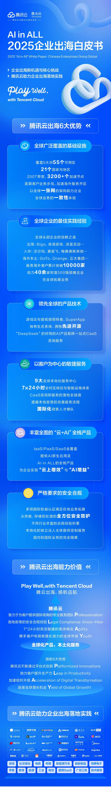

# 干货下载｜AI in ALL，2025企业出海白皮书

> 公众号: 腾讯云出海服务
> 发布时间: 2025-09-25 18:37
> 原文链接: https://mp.weixin.qq.com/s/IvMRsKsXVrS7XvdpIXst7A

---

在“AI in ALL”时代之巅，新一轮全球化浪潮奔涌向前，中国企业出海正迎来前所未有的数字变革及增长机遇。以东南亚、拉美、中东等为代表的新兴市场，凭借巨大的市场发展潜力、蓬勃的数字消费需求和友好的政治营商环境，正成为中国企业全球化布局的战略要地。

为系统梳理AI时代下出海发展趋势与实践路径，腾讯云联合霞光社，重磅推出《AI in ALL：2025企业出海白皮书》。该白皮书将从“AI in ALL”下的中国企业出海观察、腾讯云出海解决方案、腾讯云助力企业出海落地实践、未来出海展望四大维度，对AI时代下出海趋势及发展机遇进行了系统性洞察。

腾讯云依托腾讯集团二十余年的技术锤炼与积累，将十亿级用户业务的运营经验转化为可复用的专业云产品技术矩阵，为企业构建起一套「覆盖广泛、技术领先、产品全面、安全合规、经验丰富、服务敏捷」的出海能力支撑体系，助力千行百业在复杂多变的国际市场中锚定增长坐标。

👇也可点击“阅读原文”下载

**-END-**

#

# ①[2025腾讯云国际出海峰会：国际业务高双位数增长，海外客户规模同比增长翻倍](https://mp.weixin.qq.com/s?__biz=Mzg5NjgyNDMyOQ==&mid=2247487828&idx=1&sn=eda06055d3b9bde6584c81986ddae3c8&scene=21#wechat_redirect)

#

# ②[AI in ALL，共赢出海 | 腾讯云联合霞光社即将重磅推出“2025企业出海白皮书”！](https://mp.weixin.qq.com/s?__biz=Mzg5NjgyNDMyOQ==&mid=2247487817&idx=1&sn=4b164cb74ea61517f00c5e6d976964c2&scene=21#wechat_redirect)

#

# ③[【直播报名】企业出海说：中国式创新与全球竞争力构建](https://mp.weixin.qq.com/s?__biz=Mzg5NjgyNDMyOQ==&mid=2247487786&idx=1&sn=ff46a70ee163e03eb370365095169393&scene=21#wechat_redirect)

****关注我，及时获取互联网出海相关的行业趋势、云解决方案、实践案例等最新资讯****