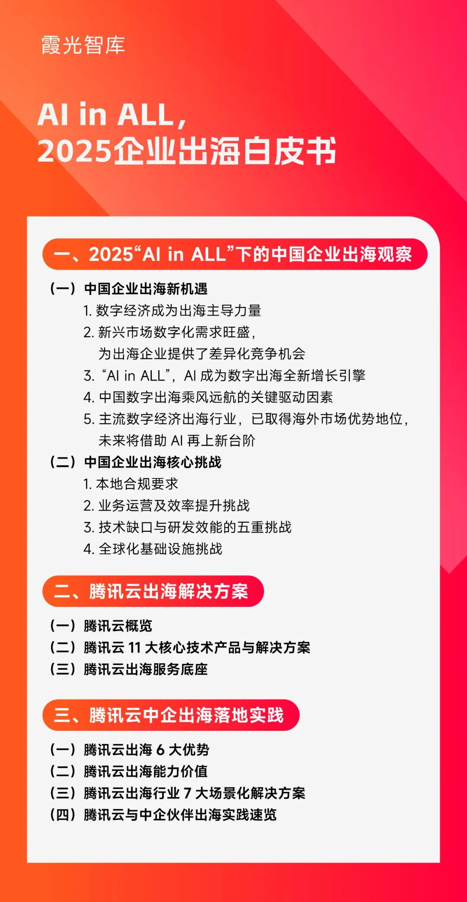

# 中企出海，到了拼“智”力的时代

> 公众号: 腾讯云出海服务
> 发布时间: 2025-09-26 17:00
> 原文链接: https://mp.weixin.qq.com/s/08d1ERzHr_cDtaHBGn8t0A

---

一部讲述古蜀国的神秘文化与未来世界的科技幻想的短剧，今年斩获了美国电影艺术奖金奖。

让人意想不到的是，这部海外出圈的短剧，并不是某个作家的精心之作，而是由AI全流程制作。

近年来，中国短剧在全球风靡，全球短剧市场也正呈现爆发趋势。数据显示，2025年海外短剧规模预计达 32 亿美元，同比增长超200%。今年上半年，海外短剧市场收入榜单中，中国公司包揽前三甲。在短剧出海背后，一个越来越明显的趋势是，AI正在成为短剧制作的利器。

2025年是国产AI大模型爆发的一年。AI正在变革出海的各行各业，从短剧、文创，到零售、汽车，再到能源、工业，从产品创新及个性化服务到产业纵深，AI已成为中国企业出海的全新增长引擎。

数据显示，去年中国短剧出海同比增长26倍。

海外巨大的短剧需求，以及AI的应用，共同推动着短剧产业链从“人工驱动”向“AI驱动”深刻变革。

在短剧生产过程中，AI 已不再仅是辅助工具，而是深度融入创意、制作与投放全流程。在近日腾讯云联合霞光社发布的《AI in ALL，2025企业出海白皮书》报告中提到（文末附下载链接），AI在短剧创作中可以辅助剧本生成、分镜设计、特效制作、后期剪辑、翻译配音、视频素材自动生成以及智能投流等各个关键环节，能够显著提升人效，正逐渐成为短剧出海的标配。

作为连续6年在IDC中国视频云解决方案市场份额排名第一的云厂商，腾讯云的AI配音及译制能力可帮助网络文学、影视、短剧等内容打破文化壁垒，实现多语种市场高效触达；此外，腾讯云的全球化云基础设施及智能媒体处理（MPS）能力，也可保障内容安全高效分发，为用户提供低时延、高分辨率的看剧体验。

从更大的视角看，在数字经济时代，AIGC技术的出现，正在打通从“创意构思”到“素材生产”再到“本地适配”的完整流程。比如，当一家出海企业需要持续高效输出符合本地化的海量内容时，AIGC的多模态生成能力能够一键生成适配不同平台和文化背景的文本、图像、视频及语音内容，极大降低创意门槛。

从内容生成，到驱动业务智能化，AI能做的还有更多。

今年9月初于德国举办的慕尼黑车展上，中国汽车供应链虽然客场作战，但光芒明显盖过德国力量。一方面，中国Tier1们在新能源大潮中集体崛起，成为全球汽车变革的主流力量；另一方面，中国汽车在智能交互、智能驾驶等方面呈现技术领先优势，备受海外消费者瞩目。

图注：IAA Mobility 2025展示的零跑（Leapmotor）汽车

过去，中国汽车出海靠的是成本优势，而在当今智能化时代，中国车企和供应链正在用AI、模式和生态创新，打造全新的出海范式。

在《2025企业出海白皮书》中，就呈现了腾讯云助力广汽出海东南亚的案例。2024年，腾讯和广汽集团战略合作升级，双方共同打造下一代混合云基础设施，用于广汽集团智能驾驶、智能座舱、企业数智化、出海等领域。在出海方面，腾讯云凭借“全球一朵云”的同源同构同服务优势与全链路服务能力，仅用2个月便帮助广汽完成东南亚海外业务的改造与上线部署；针对合规问题，腾讯云还提供了全面的合规咨询服务，帮助广汽设计出以区域合规至高点辐射周边国家、一套环境服务整个区域的合规架构，轻松应对越来越严苛的海外合规压力。而面对运维复杂与成本高企的双重挑战，腾讯云通过云原生技术和服务帮助广汽海外云业务持续降本增效。

这套成熟可复制的经验，也为后续车企出海欧美以及中东、南美等区域奠定了基础。

出海已成为中国优秀企业的第二增长曲线，而AI的赋能也将重塑中企在全球市场的竞争格局。

全球商业正进入到数字智能业务时代。

据21世纪经济报道，2025年全球企业数字化转型支出预计达2.8万亿美元， 到2026年全球2000强企业将有40%的收入来源于数字化相关的产品及服务在这一趋势下，AI、云计算、物联网等技术正成为企业的增长动力。

尽管如短剧、智能汽车等中国头部数字经济出海行业，已在海外市场呈现出明显优势地位，但未来他们将借助AI再上新台阶。并且，AI还将带动更多出海行业进一步升级。

为此，《2025企业出海白皮书》已经针对AI如何赋能数字经济出海、成为增长新引擎进行了系统化研究。

比如，在AI Agent赋能业务效率跃迁方面，AI对“人效”的提升已经从内容创作、客户服务扩展到设计、翻译、财税、金融、供应链等多个环节，因此延伸出了智能客服、智能库存管理、智能定价与促销、智能投顾、个性化学习与智能辅导等领域；

在智能营销构建差异化用户体验方面，基于AI赋能的“个性化”“智能化”和“本地化”能力，将成为打造产品差异化体验的关键，如短视频平台通过AI推荐系统实现个性化内容分发；SaaS产品借助AI客服和交互功能，实现零门槛上手和跨语言服务；营销Agent能够基于用户的行为数据和兴趣偏好，通过智能推荐引擎，提供个性化的产品推荐等；

出海尤其对本地化要求较高，人工智能恰好可以解决跨文化语境下的本地适配问题：多模态大模型（如Gemini、GPT-4）实现语音、图像、文本之间的高度理解；AI翻译系统结合语义识别和用户意图建模，能够提高跨语种沟通的质量；此外AI还能够识别当地禁忌、喜好和语言习惯，协助企业进行图文转换、视觉风格调整，以适应地域文化。

当下全球的增量已经不仅仅在欧美等成熟市场，更延伸到中东等新兴市场。这里人口结构年轻化并处于人口红利期，经济增速较高，且正在跳过互联网发展阶段直接跨越到移动时代——尽管移动互联网的渗透率较低但增长迅速。因此，新兴市场的年轻一代作为数字原住民，对新技术接受快，数字消费需求旺盛。而AI等新技术恰好满足了新兴市场对新技术的渴望，成为中国企业出海的关键力量。

然而，迎接“新航海”时代机遇的同时，与之相伴的也是前所未有的风险挑战。

今年以来，关税的反复变化、地缘政治的复杂调整，让出海企业面临的不确定性大大增加。企业也在加速实施多元化战略，从传统的欧美市场到新兴市场，从海外一线城市逐步扩展至下沉市场。

在这过程中，首先面临的问题是新兴市场基础设施的薄弱。尤其在新兴市场的部分区域，光纤覆盖不足，甚至只能靠卫星通讯，网络经常出现延迟情况，数据传输的效率和稳定性差，容易导致用户体验波动，影响企业海外拓展效果。

此外，全球数据合规相关法规仍旧存在“统一理念与碎片实践”的悖论。这表现在各国在个人数据保护权利、明确企业责任等核心原则上虽已达成共识，但在具体规则上却存在显著差异。比如，美国的“分散式立法”考验企业适应能力，欧盟GDPR对数据隐私要求严苛，印尼则限制跨境数据流动等。

另外，海外市场场景复杂，对企业的创新能力要求高。面临着来自全球的竞争，企业需要通过技术创新、产品创新来打造差异化优势。

此外，不同国家有不同的数据合规规则，如巴西要求金融数据必须本地存储，印尼限制跨境数据流动，这增加了企业在海外新兴市场开展业务的难度和成本。

因此，如何“高效出海”，已成为中国企业下一轮出海亟需回答的关键命题。

针对以上出海痛点，《2025企业出海白皮书》总结了腾讯云出海的6大优势：全球广泛覆盖的基础设施、全球企业的最佳实践经验、领先全球的产品技术、丰富全面的“云+AI”全栈产品、以客户为中心的敏捷服务、严格要求的安全合规等。这套组合拳可帮助出海企业解决从基础设施不足、技术产品创新、到市场服务和安全合规等全方位的难题。

在基础设施方面，腾讯云的数据中心覆盖全球5大洲55个可用区，有200T带宽、3200+个加速节点，以全球一张网的架构助力企业加速海外服务开区，让出海企业全球业务都能有一致性体验。

在产品方面，腾讯云可以提供AI原生应用及AI in ALL的全栈产品，从laaS、PaaS到SaaS全覆盖，为企业实现“云上增效”与“AI增益”。

在合规方面，腾讯云已经获得多项国际权威认证，可为出海企业提供从传输、存储到处理的全方位安全防护。其在海多个市场、不同行业积累的丰富合规经验，可以为本地化的独立法人主体提供定制服务。

从游戏行业助力《鸣潮》实现全球同步稳定上线，到传媒领域为新华社构建国际一流的全媒体云端平台；从泛互联网行业支撑HOLLA Group实现跨洲社交秒连，到消费电子行业协助美的完成欧洲业务系统统一管理，再到汽车、教育、零售、能源等众多领域的标杆案例，腾讯云的技术能力与服务价值，正深度融入中国企业出海的每一个关键环节，成为“全球头部企业的信赖之选”。

可以预见，随着全球数字经济的渗透加深，AI 对企业出海的赋能将更趋深度与广度——它不仅是效率工具，更是企业理解全球市场、链接全球资源、定义全球价值的核心能力，只有善用 AI 的企业，才能在全球化浪潮中真正实现从 “走出去” 到 “走进去、立得住” 的跨越。

时代正在奖励那些率先拥抱AI、善用智能云平台、将AI深度嵌入全业务流程、重构全球业务的企业。他们不仅是出海的先锋，更是未来全球数字商业生态的建设者、定义者。

原文转载来源于：霞光智库公众号

👇也可点击“阅读原文”下载

**-END-**

#

# ①[干货下载｜AI in ALL，2025企业出海白皮书](https://mp.weixin.qq.com/s?__biz=Mzg5NjgyNDMyOQ==&mid=2247487840&idx=1&sn=45f1c0b5b98e0249a2d59124aca5eb68&scene=21#wechat_redirect)

#

# ②[2025腾讯云国际出海峰会：国际业务高双位数增长，海外客户规模同比增长翻倍](https://mp.weixin.qq.com/s?__biz=Mzg5NjgyNDMyOQ==&mid=2247487828&idx=1&sn=eda06055d3b9bde6584c81986ddae3c8&scene=21#wechat_redirect)

#

# ③[AI in ALL，共赢出海 | 腾讯云联合霞光社即将重磅推出“2025企业出海白皮书”！](https://mp.weixin.qq.com/s?__biz=Mzg5NjgyNDMyOQ==&mid=2247487817&idx=1&sn=4b164cb74ea61517f00c5e6d976964c2&scene=21#wechat_redirect)

****关注我，及时获取互联网出海相关的行业趋势、云解决方案、实践案例等最新资讯****