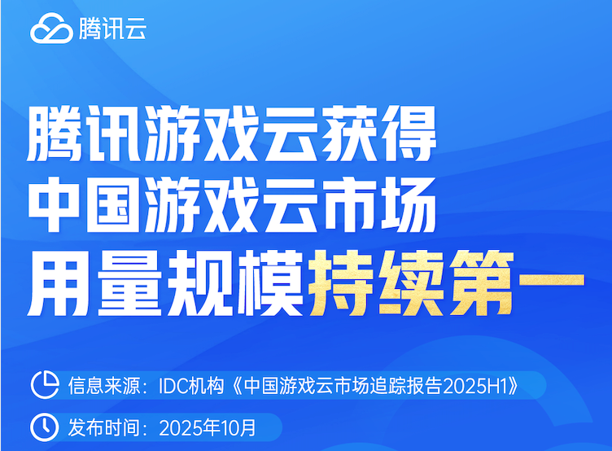
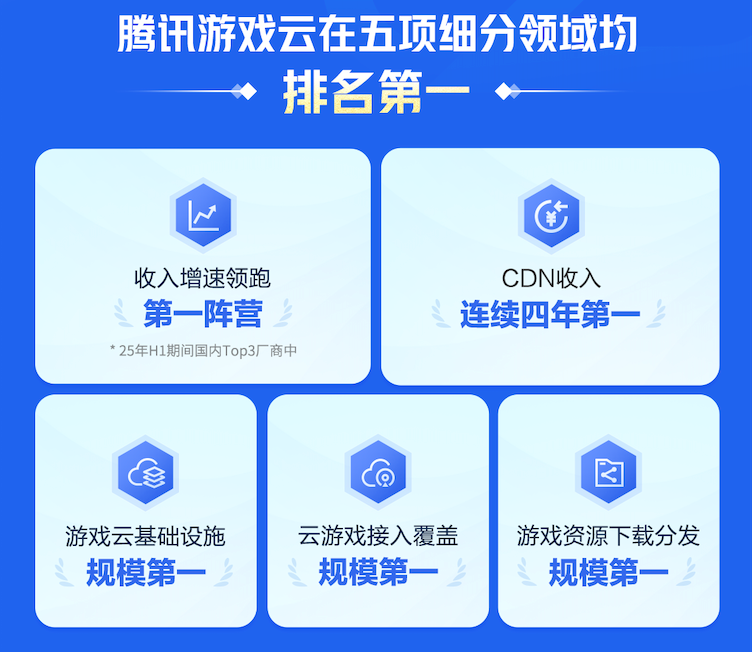
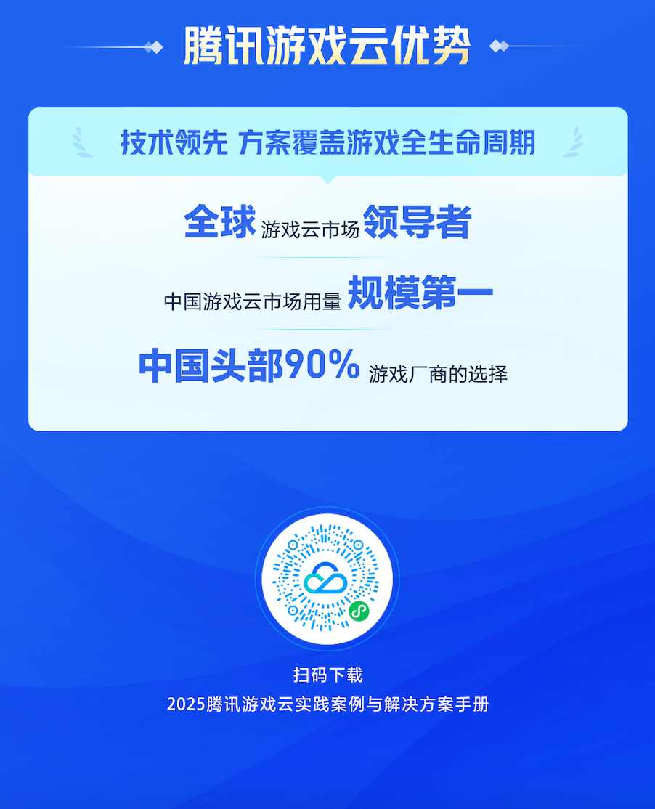

# 腾讯云领跑中国游戏云市场，用量规模持续多年第一！

> 公众号: 腾讯云出海服务
> 发布时间: 2025-10-29 18:02
> 原文链接: https://mp.weixin.qq.com/s/8eCR3MvX10D9_LPpbYqIUQ

---

10月29日，国际数据公司（IDC）发布了《中国游戏云市场跟踪研究，2025H1》报告（以下简称“报告”）。报告显示，2025年上半年中国游戏云市场中，腾讯云继续展现出强劲的领先优势，不仅在用量规模维度持续稳居第一并实现连续多期领先，还在整体收入维度增速领跑第一阵营（Top3）。

在报告的多个关键细分赛道中，腾讯云也凭借领先的游戏技术积累和行业经验斩获佳绩，包括游戏云基础设施规模、云游戏接入覆盖规模、游戏资源下载分发规模均获第一，充分展现了腾讯云在游戏云服务领域的综合实力。

腾讯游戏云用量规模持续第一

收入增速领跑行业第一阵营

作为国内90%以上游戏行业头部厂商首选的云服务商，腾讯云凭借长期在游戏领域的深耕积累，已构建起涵盖从底层资源到场景化解决方案的全栈服务体系，不仅在性能、覆盖、稳定性方面实现行业领先，也在助力游戏企业在提质增效方面持续创造价值。

腾讯云在游戏行业积累了大量的案例经验，覆盖了从游戏研发测试到发行上线，以及后期运营增长等全生命周期场景，提供了如游戏数据库、游戏云原生、游戏反外挂、安全合规、用户调研等不同场景的解决方案。以更简单、更高效的方式支持游戏企业的研发运营工作，助力游戏行业实现快速、高质量发展。

腾讯游戏云升级全生命周期解决方案

让AI成为游戏开发的新引擎

随着人工智能技术的快速发展，AI在游戏研发、创作与运营各环节中的应用正全面提速，成为推动游戏产业提效升级与内容革新的关键引擎。从大模型驱动下的代码生成、图形建模，到运营环节的广告创意优化与玩家行为分析，AI正在不断提升游戏行业的开发效率与质量，让游戏开发更高效、创意更快速落地、运营决策更加智能精准。

腾讯云基于多年游戏行业技术积累与AI研发实力，于2025年腾讯全球数字生态大会期间发布了全新升级的全生命周期解决方案，依托腾讯自研混元大模型能力，以及腾讯游戏多年积累的AI实践经验，构建起覆盖游戏创意构思、美术创作、研发测试、发行上线、到运营增长的全流程技术支撑体系，面向内容、代码、运营等多环节，帮助游戏开发者释放开发创意、提升生产效率。

与创梦天地《卡拉彼丘》手游项目的合作中，针对游戏复杂的玩法机制，腾讯云AI代码助手CodeBuddy深度参与游戏开发流程，实现代码补全、测试生成、逻辑诊断等功能，让项目整体研发效率提升超10%。在腾讯云全链路技术支持下，游戏顺利如期上线，并于公测首日登顶iOS免费榜与安卓多平台榜首，收获了亮眼的市场表现。

在此前全球权威市场调研机构 Omdia 发布的《Omdia 市场雷达：2025 年全球游戏云平台》报告中，腾讯云就已成功跻身“全球游戏云平台领导者”象限，成为唯一入选的中国云服务商。腾讯云在游戏服务器、多人游戏服务、人工智能与机器学习三大核心能力维度均获评最高等级（Advanced）。

目前，腾讯云已服务国内95%以上出海头部游戏公司，已成为包括创梦天地、库洛游戏、西山居、莉莉丝完美世界等众多知名厂商在内的首选合作伙伴，广泛参与到其从游戏研发、版本迭代，到全球上线、出海运营等各个关键环节，持续以技术驱动游戏开发者更高效的玩法创意实现与游戏的全球化发行。

👇也可点击“阅读原文”下载

**-END-**

#

# ①[中企出海，到了拼“智”力的时代](https://mp.weixin.qq.com/s?__biz=Mzg5NjgyNDMyOQ==&mid=2247487844&idx=1&sn=c73110797f7857e86fcca4a0e221250c&scene=21#wechat_redirect)

#

# ②[干货下载｜AI in ALL，2025企业出海白皮书](https://mp.weixin.qq.com/s?__biz=Mzg5NjgyNDMyOQ==&mid=2247487840&idx=1&sn=45f1c0b5b98e0249a2d59124aca5eb68&scene=21#wechat_redirect)

#

# ③[2025腾讯云国际出海峰会：国际业务高双位数增长，海外客户规模同比增长翻倍](https://mp.weixin.qq.com/s?__biz=Mzg5NjgyNDMyOQ==&mid=2247487828&idx=1&sn=eda06055d3b9bde6584c81986ddae3c8&scene=21#wechat_redirect)

****关注我，及时获取互联网出海相关的行业趋势、云解决方案、实践案例等最新资讯****