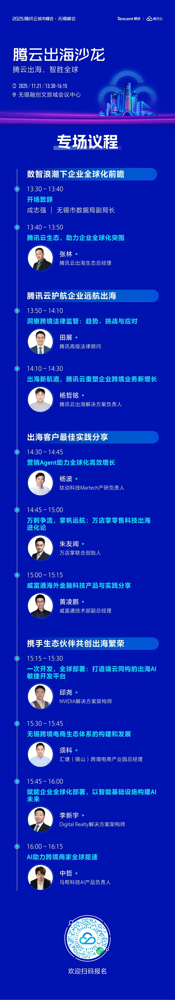
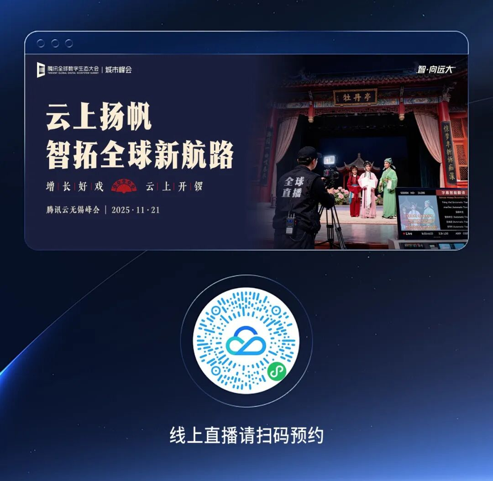

# 扬帆破浪，智赢全球｜腾云出海沙龙无锡站即将启航

> 公众号: 腾讯云出海服务
> 发布时间: 2025-11-18 18:00
> 原文链接: https://mp.weixin.qq.com/s/TB_GjowLPBYVKhFfuDZyGQ

---

在全球市场机遇与出海合规等挑战并存的当下，如何实现业务全球高效布局及稳健增长已成为出海企业持续思考的命题。

政策法规瞬息万变，如何规避合规风险，让航行稳如泰山？

商业模式因地制宜，如何借出海一站式解决方案，让本地运营事半功倍？

竞争日趋白热化，如何借鉴先行者的实战经验，让增长快人一步？

我们诚邀您观看11月21日13:30 - 16:15「腾云远航出海沙龙」直播。本场沙龙将以“技术+生态”双轮驱动，聚焦跨境电商、跨境支付、品牌出海营销增长等关键议题，分享全球合规趋势解读、腾讯云出海服务的能力与价值，及头部企业与伙伴出海实践经验，加速出海企业全球高效展业及业务创新增长。诚挚邀请您的参与！

机遇与挑战并存的全球市场，单打独斗不如借帆航行。

我们诚挚地邀请您云端参会，共同聆听精彩内容，探索出海一站式解决方案。欢迎扫码预约直播，期待与您线上相见。

扫码免费获取腾讯云最新发布的 《AI in ALL：2025企业出海白皮书》 ，助您先行一步，智赢全球。

该白皮书从“AI in ALL”视角出发，系统梳理了中国企业出海观察、腾讯云解决方案、落地实践及未来展望四大维度，全面揭示AI时代的出海新趋势与发展机遇。

**-END-**

#

# ①[腾讯云领跑中国游戏云市场，用量规模持续多年第一！](https://mp.weixin.qq.com/s?__biz=Mzg5NjgyNDMyOQ==&mid=2247487855&idx=1&sn=d5dc0fbe7cb4652517b7024e7db35292&scene=21#wechat_redirect)

#

# ②[中企出海，到了拼“智”力的时代](https://mp.weixin.qq.com/s?__biz=Mzg5NjgyNDMyOQ==&mid=2247487844&idx=1&sn=c73110797f7857e86fcca4a0e221250c&scene=21#wechat_redirect)

#

# ③[干货下载｜AI in ALL，2025企业出海白皮书](https://mp.weixin.qq.com/s?__biz=Mzg5NjgyNDMyOQ==&mid=2247487840&idx=1&sn=45f1c0b5b98e0249a2d59124aca5eb68&scene=21#wechat_redirect)

****关注我，及时获取互联网出海相关的行业趋势、云解决方案、实践案例等最新资讯****