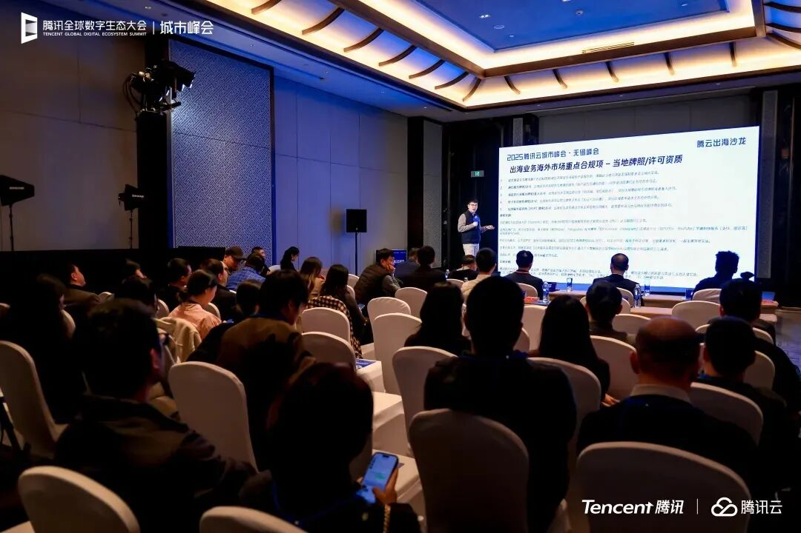

# 从产品出海到数字化出海 腾讯云全链路助力企业开展全球业务

> 公众号: 腾讯云出海服务
> 发布时间: 2025-12-01 18:00
> 原文链接: https://mp.weixin.qq.com/s/j8vusknh7x0vBPpsTbxq7Q

---

“过去三年持续保持高双位数增长，服务海外客户超2万家，覆盖80多个国家和地区，成为90%以上头部互联网企业及95%以上头部游戏公司的出海选择。”近日，在腾讯云无锡峰会“腾云出海”沙龙上，腾讯云对外展示了最新的助力企业出海成绩单。

为支持更多企业“走出去、走得远”，无锡市数据局副局长成志强在沙龙开场致辞中提出三点期望：一是打造一站式服务，提供符合国际规则与中国国情的合规解决方案；二是强化技术支撑，发挥云计算、人工智能等技术优势，针对产业特点开发定制化服务；三是深化生态协同，建立常态化合作机制，共同构建“技术+产业+政策”的出海服务新生态。

“不出海，就出局。出海已成为中国近半数上市公司的必然选择。”腾讯云出海生态总经理张林精准洞察了当前出海的四大趋势：一是品类跃升，从基础商品贸易向高端制造与技术服务业等高附加值领域扩展；二是市场拓展，从聚焦欧美主流市场向“一带一路”共建国家等新兴市场拓展；三是模式深化，从单一出口转向本地化生产、技术合作等深度模式；四是技术突破，AI技术正重塑生产与成本模式，显著降低了出海门槛。

聚焦全球基建、数字技术与合规经验，

破解出海核心难题

趋势之下，稳定的技术底座是企业出海的先决条件。腾讯云出海解决方案负责人杨哲铭介绍了腾讯云的全球技术实力与场景化解决方案。他表示，腾讯云基础设施覆盖全球，在全球22个地区、运营着64个可用区，并依托全球3200个网络节点构建了强大的加速网络。

出海航程，数据合规是必须守住的“底线”。腾讯高级法律顾问田展从实战出发，分享了腾讯云在数据合规领域的深刻洞察。他指出：“全球144个国家都有自己的数据保护法”，企业必须默认当地市场对数据保护有合规要求。他强调，合规是一个动态且全面的过程，涉及牌照资质、数据本地化驻留、AI监管等多个维度。腾讯云凭借自身产品出海积累的丰富经验，能够帮助企业系统性识别风险，尤其是在企业作为“数据控制者”还是“数据处理者”的不同法律责任上，提供关键指导，筑牢出海安全防线。

这一合规能力，建立在腾讯云全球基础设施与服务体系的持续投入之上。目前，腾讯云在沙特投资1.5亿美元建设中东首个可用区，在日本大阪新建第三个可用区；在全球设立的11个区域办公室与9大技术支持中心，服务覆盖30多个行业与80多个国家和地区。同时，腾讯云已累计获得400多项国际专业认证，覆盖GDPR、SOC、ISO等20多个领域的全球主流标准，构建了全面适配全球法规的技术生态。

从智能营销到门店管理，

助力企业实现全球业务落地

在出海落地层面，腾讯云携手各领域伙伴，共同为出海企业构建了覆盖关键场景的服务闭环，其价值已在众多标杆客户的实践中得到验证。

钛动科技Martech产研负责人杨波展示了基于腾讯云大模型技术打造的AI智能体“Navos”。基于腾讯云覆盖全球的云基础设施与强大的数据训练能力，钛动科技将多年营销经验封装为可调用的工具，帮助企业快速制定海外营销策略。例如，一家华南AI硬件工厂借助该智能体分析市场，实现了从产品到海外品牌“从0到1”的破局。

在连锁零售的线下出海场景中，万店掌联合创始人朱友闻介绍，依托腾讯云全球数据合规经验，以及计算、存储、网络、AI知识引擎等产品技术，万店掌为国内头部潮流零售品牌、万店连锁咖啡品牌等连锁品牌实现全球门店的统一运营与本地化数据合规管理。

在跨境支付领域，威富通技术部副总经理黄凌鹏表示，基于腾讯云弹性计算、数据库、支付能力等数字化技术，威富通为中银香港、中东Tiqmo等200多家海外金融机构提供支付与数字钱包服务，日均处理超4000万笔交易，保障了出海企业资金流的全球稳定与安全流转。

此外，马帮科技、Digital Realty、汇塘（锡山）跨境电商产业园等生态伙伴也分享了基于腾讯云的技术与资源协同成果，从基础设施协同、技术应用创新、产业赋能三个层面全面展现与腾讯云生态联动价值。

在中国企业从“产品出海”迈向“品牌出海”与“数字化出海”的升级道路上，腾讯云正通过其领先的全球数字基础设施、全链路技术方案、深耕实践的合规经验以及强大的生态协同，为企业构建从技术底座到业务增长的“安全高效通道”。面对“不出海，就出局”的时代命题，腾讯云将持续以全链路能力，助力中国企业在全球市场的广阔航道上行稳致远。

扫码免费获取腾讯云最新发布的 《AI in ALL：2025企业出海白皮书》 ，助您先行一步，智赢全球。

该白皮书从“AI in ALL”视角出发，系统梳理了中国企业出海观察、腾讯云解决方案、落地实践及未来展望四大维度，全面揭示AI时代的出海新趋势与发展机遇。

**-END-**

#

# ①[扬帆破浪，智赢全球｜腾云出海沙龙无锡站即将启航](https://mp.weixin.qq.com/s?__biz=Mzg5NjgyNDMyOQ==&mid=2247487869&idx=1&sn=6cc205d75da1ea0ed886a76ef1275b29&scene=21#wechat_redirect)

#

# ②[腾讯云领跑中国游戏云市场，用量规模持续多年第一！](https://mp.weixin.qq.com/s?__biz=Mzg5NjgyNDMyOQ==&mid=2247487855&idx=1&sn=d5dc0fbe7cb4652517b7024e7db35292&scene=21#wechat_redirect)

#

# ③[中企出海，到了拼“智”力的时代](https://mp.weixin.qq.com/s?__biz=Mzg5NjgyNDMyOQ==&mid=2247487844&idx=1&sn=c73110797f7857e86fcca4a0e221250c&scene=21#wechat_redirect)

****关注我，及时获取互联网出海相关的行业趋势、云解决方案、实践案例等最新资讯****