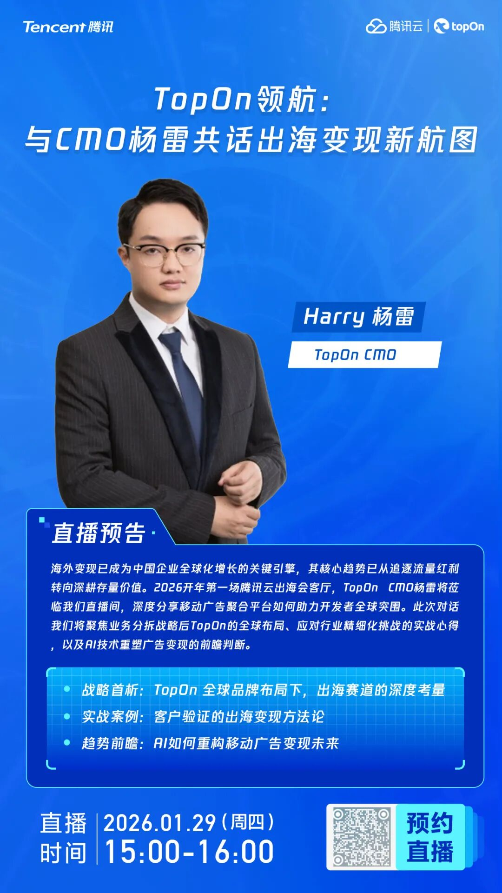

# 腾讯云出海会客厅 | 2026开年首谈：与 TopOn CMO 共话移动广告变现新航图

> 公众号: 腾讯云出海服务
> 发布时间: 2026-01-23 19:30
> 原文链接: https://mp.weixin.qq.com/s/zi_sjahvEWk283qYiaVifQ

---

伴随企业全球化进入存量深耕的新阶段，如何通过精细化运营与技术创新实现持续增长，成为出海企业共同关注命题。2026 开年，腾讯云出海会客厅特邀全球领先移动广告聚合工具平台TopOn CMO Harry杨雷，围绕全球流量生态变化、广告变现效率提升及 AI 技术重构广告变现场景等核心话题，展开深度对话，为出海企业提供可落地的方法论。

##

直播时间：2026 年 1 月 29 日（周四）15:00-16:00

存量时代，出海增长的核心是 “效率” 与 “确定性”。本次对话聚焦海外流量变现痛点，探讨可直接复用的策略与方法，邀您一同探索移动广告变现的深层逻辑，为新一年出海增长找准方向。

下方扫码获取腾讯云最新发布的 《AI in ALL：2025企业出海白皮书》 ，了解更多TopOn携手腾讯云出海最佳实践，助您先行一步，智赢全球。

**-END-**

#

# ①[腾讯游戏云2025回顾：以全周期赋能，赢得95%出海头部厂商共同选择](https://mp.weixin.qq.com/s?__biz=Mzg5NjgyNDMyOQ==&mid=2247487883&idx=1&sn=40962fcd643d97d4607c19a48e53c1eb&scene=21#wechat_redirect)

#

# ②[从产品出海到数字化出海 腾讯云全链路助力企业开展全球业务](https://mp.weixin.qq.com/s?__biz=Mzg5NjgyNDMyOQ==&mid=2247487875&idx=1&sn=310ab0fd16df2240a1ab56c8cee6ebdc&scene=21#wechat_redirect)

#

# ③[扬帆破浪，智赢全球｜腾云出海沙龙无锡站即将启航](https://mp.weixin.qq.com/s?__biz=Mzg5NjgyNDMyOQ==&mid=2247487869&idx=1&sn=6cc205d75da1ea0ed886a76ef1275b29&scene=21#wechat_redirect)

****关注我，及时获取互联网出海相关的行业趋势、云解决方案、实践案例等最新资讯****