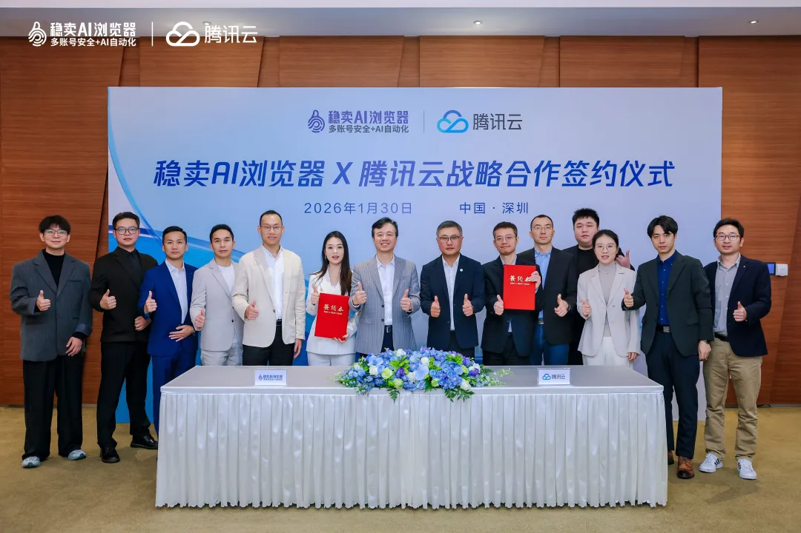

# 腾讯云与稳卖AI浏览器达成战略合作，AI大模型助跨境生态提效超200倍

> 公众号: 腾讯云出海服务
> 发布时间: 2026-01-30 17:23
> 原文链接: https://mp.weixin.qq.com/s/Q6LOj-ig4XW_sp0PKqHVSg

---

1月30日，腾讯云与萨摩耶旗下深圳市稳卖科技有限公司（以下简称“稳卖科技”）签署战略合作协议。双方宣布，将深度整合腾讯云在云计算、AI大模型等领域的技术底座，与稳卖AI浏览器在跨境生态的深厚业务积淀，共同探索“AI+跨境”的无限可能，助力跨境卖家全球化业务拓展与效能提升。

签约仪式上，腾讯云高级副总裁徐翊鸣与稳卖科技董事长林建明亲临见证 。腾讯云数字金融副总经理罗盛与稳卖科技高级副总裁罗紫红代表双方签署战略合作协议 。

***云上赋能：***

***构筑高性价比、极速安全的跨境基座***

在全球化贸易浪潮中，跨境电商卖家长期面临着环境复杂、网络不稳定、运营成本高等底层技术难题。传统的跨境访问模式下，账号关联风险、IP漂移等问题也严重制约了卖家的规模化扩张。

基于腾讯云全球高可用的云基础设施及腾讯云Lighthouse（轻量应用服务器），稳卖AI浏览器为跨境电商卖家提供了高质量、安全的店铺运营环境，从根本上解决了跨境店铺运营中的账号关联与封号风险 。

● 用户体验方面： 腾讯云通过创新的架构设计实现了动静态数据的分离，并结合EO全球加速边缘节点，将海外站点的首页加载延迟从10秒压缩至3秒，整体访问延时降低了60% 。这一提升，确保了跨境卖家在管理全球店铺时，能拥有如本地办公般的流畅体验。

● 架构层面：稳卖科技的后台服务全面基于腾讯云云原生产品服务构建，包括腾讯云Serverless容器服务及云原生数据库TDSQL-C Mysql, 在保障高可用的同时，实现了极致的弹性伸缩与智能调度，整体IT成本较传统云服务降低了超过30%，从而能将更多资源投入到AI应用层的创新中。

***强强联手：***

***以 AI 重塑跨境业务全流程***

不仅如此，腾讯云与稳卖AI浏览器双方将围绕跨境电商 AI 应用场景展开深度协同。腾讯云依托混元AI大模型、智能体开发平台ADP等全栈AI能力，结合稳卖科技在跨境电商领域积累的全链路业务数据、垂直工具链研发能力及成熟的商业化经验，联合打造面向跨境卖家的 AI 智能运营解决方案。

● 商品智能分析：依托腾讯混元大模型及AI平台工具，结合亚马逊 ASIN 等数据，构建商品信息解析与价值评估能力，支持选品分析与运营决策。

● 多模态内容生成：内容创作一直是跨境电商的核心痛点。依托腾讯混元及业内领先的AI大模型，稳卖AI浏览器实现了文生图、图生图、多模态视频生成等能力 。卖家只需输入简单的文字描述，AI即可批量生成极具吸引力的商品主图、场景图及A+页面素材，甚至包括专业级的产品宣传视频，极大地释放了设计与文案的生产力 。

● AI 智能运营 Agent：基于腾讯云ADP平台打造的AI运营智能体，将分散的内容创作与商品分析能力有机整合 。就如同卖家的“数字助理”，能够自主完成店铺日常维护、文案撰写、选品调研等繁琐任务，推动跨境电商运营从碎片化走向系统化与标准化 。

***AI工具调用量暴涨超8倍，***

***跨境卖家提效超200倍***

目前，腾讯云与稳卖AI浏览器合作的 AI 能力已在商品分析、图片及视频素材生成等核心场景实现规模化应用，平台整体 AI 工具调用量提升约 8–12 倍，助力数百家跨境电商实现效能提升。

以一家业务覆盖欧美、东南亚等10多个主流国家、日常管理数百个亚马逊账号的中型跨境卖家为例 。在传统的人工模式下，运营团队完成单款商品的标题、五点描述及视觉素材制作，平均耗时超过3小时 。而选品调研更是依赖资深运营的经验，单款选品调研耗时常在8小时以上，且转化率不足30%，导致核心能力难以规模化复制 。

接入腾讯云赋能的稳卖AI浏览器后，该卖家运营效率大幅提升：单款商品的内容生产耗时从3小时被压缩至5分钟以内，效率提升超过35倍 ；AI 选品分析替代人工调研，单款商品分析周期由 8 小时以上缩短至 30 分钟以内，整体分析效率提升约 15倍；单 SKU 图片及视频素材的生产耗时由原来的 3–5 天压缩至数十分钟以内，实现超200倍的效率提升。

目前，跨境商家从选品分析、内容生成、素材制作到上架准备等超过 95%的运营动作均可通过AI 与自动化流程完成，以更少的人力实现更高效的规模化运营，成功突破传统模式的增长瓶颈。

未来，腾讯云将与稳卖AI浏览器持续深化合作，通过 AI 能力在跨境电商场景的持续演进，为全球卖家提供“智能运营大脑”，推动跨境电商向规模化、标准化与智能化迈进。

下方扫码获取腾讯云最新发布的 《AI in ALL：2025企业出海白皮书》 ，了解更多企业出海最佳实践，助您先行一步，智赢全球。

**-END-**

#

# ①[腾讯云出海会客厅 | 2026开年首谈：与 TopOn CMO 共话移动广告变现新航图](https://mp.weixin.qq.com/s?__biz=Mzg5NjgyNDMyOQ==&mid=2247487894&idx=1&sn=e7f1baaba775f84c1bd0a0583f64bb69&scene=21#wechat_redirect)

#

# ②[腾讯游戏云2025回顾：以全周期赋能，赢得95%出海头部厂商共同选择](https://mp.weixin.qq.com/s?__biz=Mzg5NjgyNDMyOQ==&mid=2247487883&idx=1&sn=40962fcd643d97d4607c19a48e53c1eb&scene=21#wechat_redirect)

#

# ③[从产品出海到数字化出海 腾讯云全链路助力企业开展全球业务](https://mp.weixin.qq.com/s?__biz=Mzg5NjgyNDMyOQ==&mid=2247487875&idx=1&sn=310ab0fd16df2240a1ab56c8cee6ebdc&scene=21#wechat_redirect)

****关注我，及时获取互联网出海相关的行业趋势、云解决方案、实践案例等最新资讯****