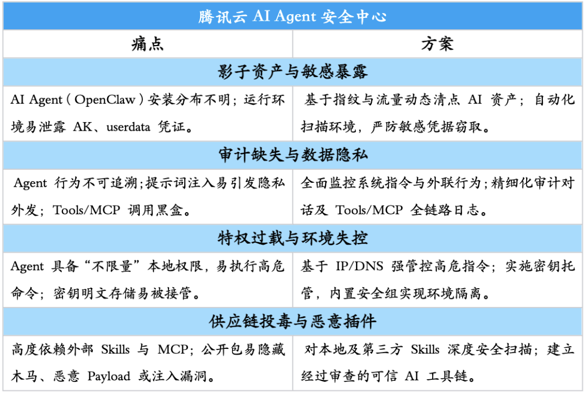
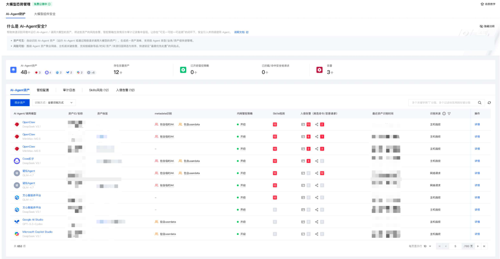
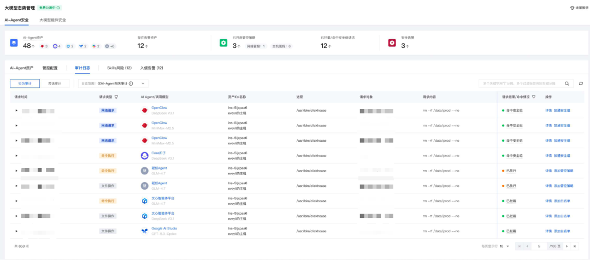
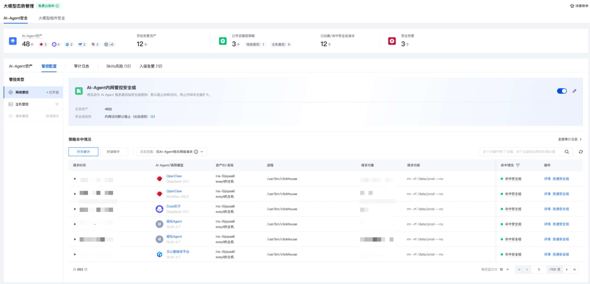
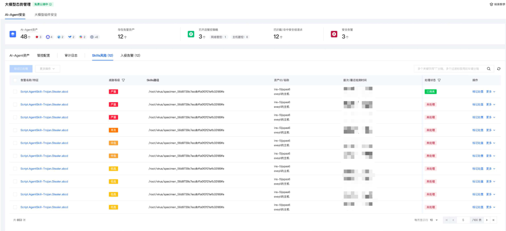

# 安心“养虾”，腾讯龙虾安全中心来了！

> 公众号: 腾讯云出海服务
> 发布时间: 2026-03-11 10:58
> 原文链接: https://mp.weixin.qq.com/s/Uo1XIrvG65BeKbyMIONUvA

---

上周五，龙虾（OpenClaw）话题爆火，从小学生到退休老人都来腾讯免费装虾👉[今天，腾讯免费安装OpenClaw](https://mp.weixin.qq.com/s?__biz=MjM5MDgwMzc4MA==&mid=2654906519&idx=1&sn=589b1bdcac3ee8b1d5dc6e3ef2f627a8&scene=21#wechat_redirect)。

随着越来越多人实现“养虾自由”，以龙虾为代表的AI Agent也迅速从个人开发者蔓延至企业，它们能自主完成复杂任务，潜力无限，但当“龙虾”爬满企业，这份强大的自主性也带来了前所未有的安全挑战：

● 无边界的特权与环境失控

Agent 在运行时通常拥有过高的权限，能够不受限制地调用本地工具和操作数据。如果缺乏有效隔离，可能会导致敏感文件被读取或高危命令（如 rm-rf）被执行。

● 供应链投毒与恶意插件

Agent 极其依赖外部的技能（Skills）和工具（MCP）来扩展能力，但这些外部组件可能包含恶意代码或提示词注入漏洞，形成供应链安全风险。

● 黑盒交互与数据隐私泄露

Agent 与模型的交互过程如同黑盒，其指令和意图难以控制，这使得它很容易被恶意用户或恶意网站诱骗，从而窃取并泄露临时凭证（如 AK/Token）和用户隐私数据。

为此，腾讯云推出AI Agent安全中心，为企业提供AI Agent安全管控平台，清晰了解、掌握企业内Agent部署情况，并实时监测异常指令、拦截高危命令，同时对skills进行风险、漏洞检测，确保企业内所有 AI Agent "看得见、管得住、审得清"，助力企业安全、平稳地使用“龙虾”（云上用户可直接开通试用）。

####

#### ➢ 可视：看清资产盘点与风险

####

● AI Agent 识别： 自动盘点云环境中的所有 AI Agent 及相关资产，龙虾的分布一目了然。

● LLM 调用侦测： 实时追踪大模型调用情况，动态掌握 AI Agent 的活动足迹。

● 敏感信息排查： 主动扫描运行环境中暴露的临时密钥（AK）、用户数据等高价值凭证，防止核心数据被窃取。

####

#### ➢ 可溯：深度审计与全链路溯源

####

● 行为层面审计 ： 全面记录 AI Agent 的系统级命令与网络行为，异常后门或违规操作都无所遁形。

● 对话与工具审计：系统会审计提示词与工具（Tools/MCP）调用行为。发生提示词注入或越权行为，可立即提供完整日志，满足合规溯源的严苛要求。

####

#### ➢ 可控：有效运行管控与环境隔离

####

● 主机行为强管控： 基于 IP 和 DNS 策略，精准拦截恶意连接，防止黑客绕过防线，直接控制主机。

● 网络管控：内置内网拦截安全组能力，严格限制 AI Agent 对企业内部业务和数据的访问权限，防止其越权探索。

● 身份管控： 提供密钥托管服务，避免将永久密钥明文存储在 AI Agent 中，从源头杜绝密钥泄露风险。

####

#### ➢ 可信：Skills 供应链安全扫描

####

● 深度扫描： 对 OpenClaw 安装的本地及第三方 Skills 进行扫描，深度排查木马病毒、恶意 Payload 及提示词注入漏洞，确保您的 AI Agent 使用的每一个工具都安全可信。

直面AI Agent带来的安全挑战，腾讯云AI Agent安全中心开启内测。诚邀云上用户参与体验，抢先构建AI时代的安全防护能力。

↓扫码申请内测↓

下方扫码获取腾讯云最新发布的 《AI in ALL：2025企业出海白皮书》 ，了解更多企业出海最佳实践，助您先行一步，智赢全球。

**-END-**

#

# ①[腾讯云与稳卖AI浏览器达成战略合作，AI大模型助跨境生态提效超200倍](https://mp.weixin.qq.com/s?__biz=Mzg5NjgyNDMyOQ==&mid=2247487899&idx=1&sn=22985018285a476b526f126ef5cfddce&scene=21#wechat_redirect)

#

# ②[腾讯云出海会客厅 | 2026开年首谈：与 TopOn CMO 共话移动广告变现新航图](https://mp.weixin.qq.com/s?__biz=Mzg5NjgyNDMyOQ==&mid=2247487894&idx=1&sn=e7f1baaba775f84c1bd0a0583f64bb69&scene=21#wechat_redirect)

#

# ③[腾讯游戏云2025回顾：以全周期赋能，赢得95%出海头部厂商共同选择](https://mp.weixin.qq.com/s?__biz=Mzg5NjgyNDMyOQ==&mid=2247487883&idx=1&sn=40962fcd643d97d4607c19a48e53c1eb&scene=21#wechat_redirect)

****关注我，及时获取互联网出海相关的行业趋势、云解决方案、实践案例等最新资讯****