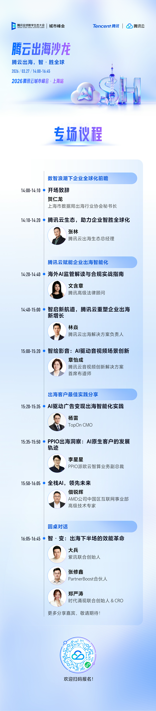

# 腾云出海，智・胜全球｜腾云出海上海站，共探企业出海智能化新范式！

> 公众号: 腾讯云出海服务
> 发布时间: 2026-03-17 12:03
> 原文链接: https://mp.weixin.qq.com/s/BIduUDBsfmezACxh9dhD7Q

---

面对海外市场的广阔前景与日趋复杂的国际环境，如何实现安全、高效、智能的全球业务增长，已成为出海企业亟需破解的核心课题。

合规之路道阻且长，如何借助AI 赋能的风控体系精准规避风险、确保业务合法合规？

业务增长面临天花板，如何以智算架构驱动业务智能化升级，借AI之力实现持续增长？

全球化布局步步为营，如何借一站式解决方案与实战经验，让出海之路更顺畅？

我们诚邀您锁定3 月 27 日 14:00-16:45线上直播，参与2026 腾讯云城市峰会上海站・腾云出海沙龙。聚焦出海智能化转型核心痛点，通过合规解读、技术分享与案例拆解，为企业提供可落地、可复用的增长方案，助力全球化布局提质增效。

登云见智，共探出海新机遇，助力企业在全球市场行稳致远、持续增长。

下方扫码获取腾讯云最新发布的 《AI in ALL：2025企业出海白皮书》 ，了解更多企业出海最佳实践，助您先行一步，智赢全球。

**-END-**

#

# ①[直播预告｜腾讯游戏云技术在线 26 年第一期・GDC 2026 游戏技术前沿特辑来袭！](https://mp.weixin.qq.com/s?__biz=Mzg5NjgyNDMyOQ==&mid=2247487912&idx=1&sn=72603341745e63434f768aef23118680&scene=21#wechat_redirect)

#

# ②[安心“养虾”，腾讯龙虾安全中心来了！](https://mp.weixin.qq.com/s?__biz=Mzg5NjgyNDMyOQ==&mid=2247487904&idx=1&sn=f4de0a00b52d99a30fecab221caf4ec2&scene=21#wechat_redirect)

#

# ③[腾讯云与稳卖AI浏览器达成战略合作，AI大模型助跨境生态提效超200倍](https://mp.weixin.qq.com/s?__biz=Mzg5NjgyNDMyOQ==&mid=2247487899&idx=1&sn=22985018285a476b526f126ef5cfddce&scene=21#wechat_redirect)

****关注我，及时获取互联网出海相关的行业趋势、云解决方案、实践案例等最新资讯****