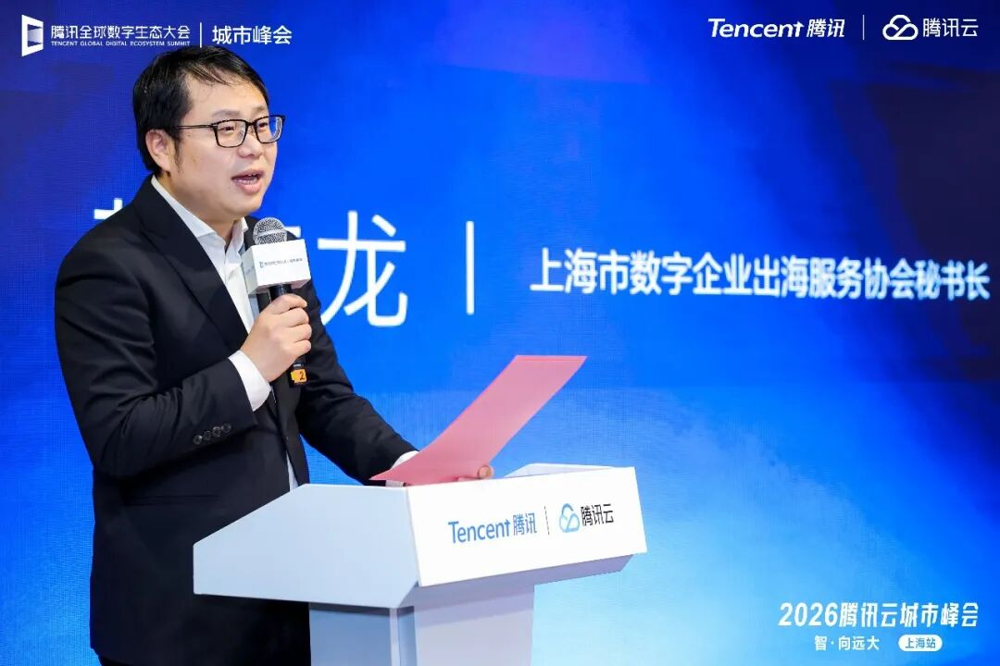
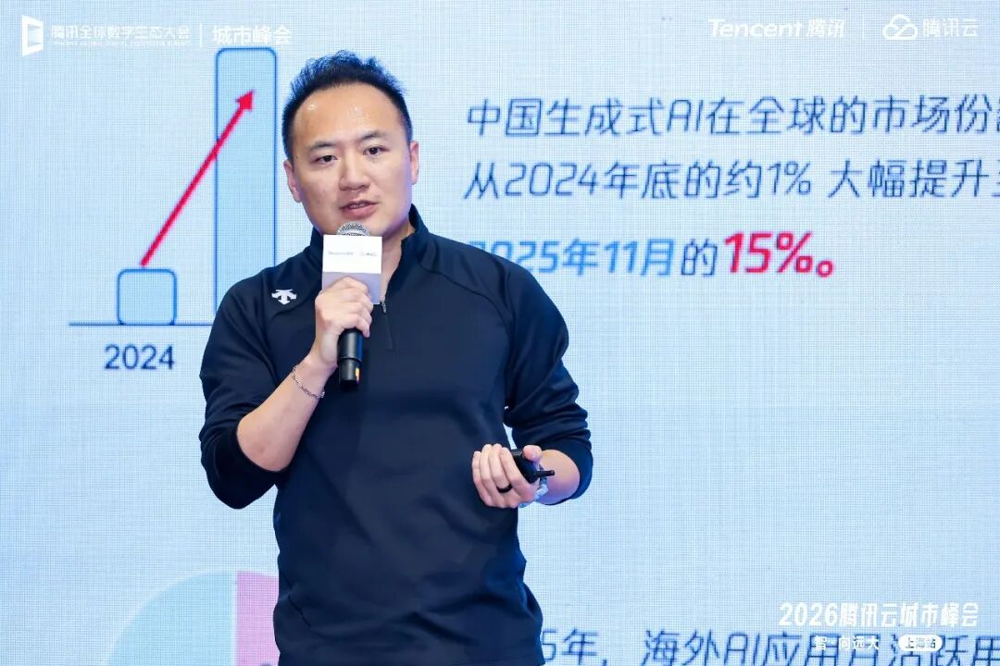
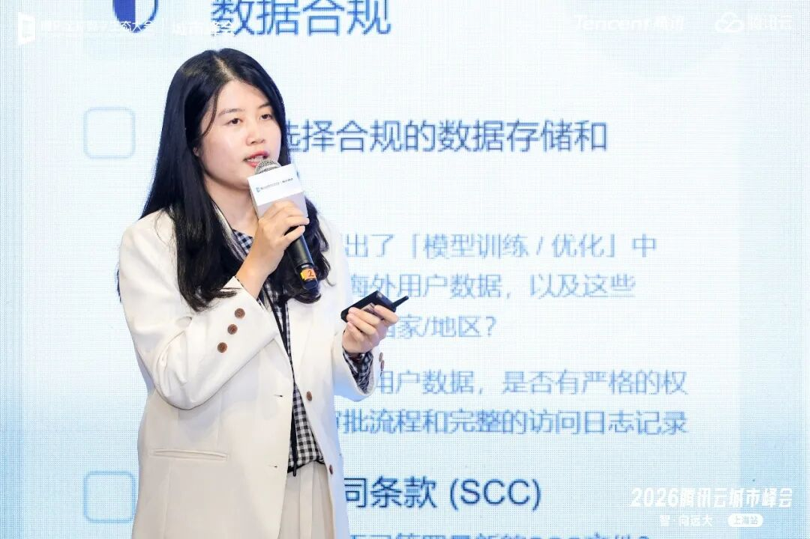
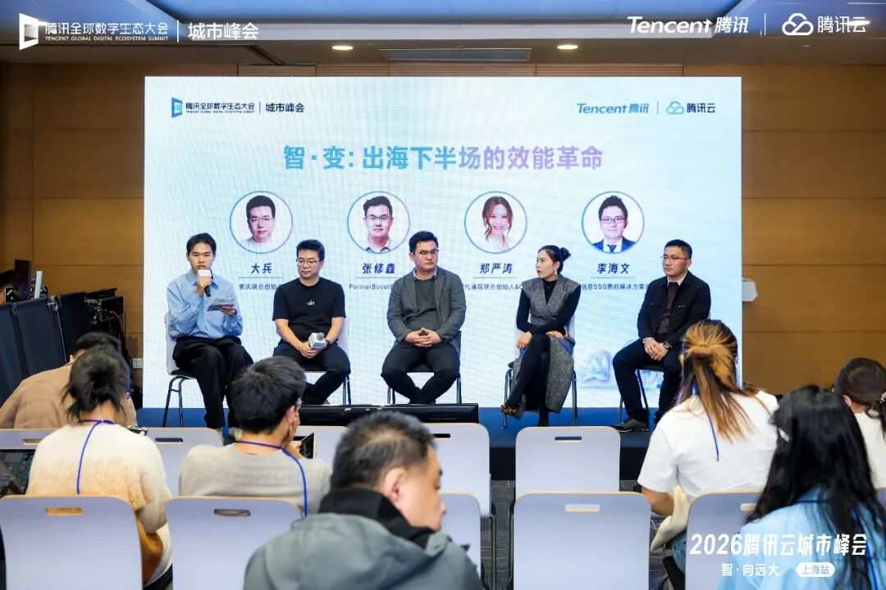
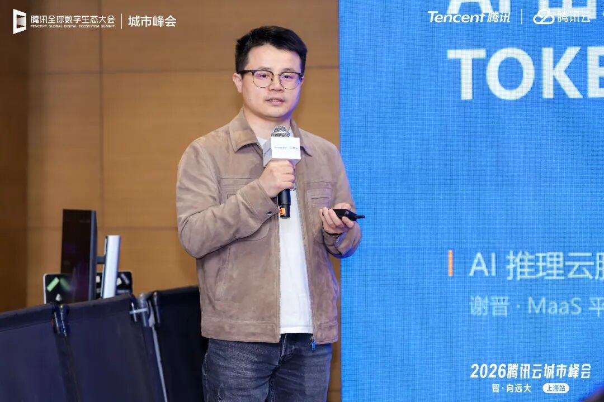
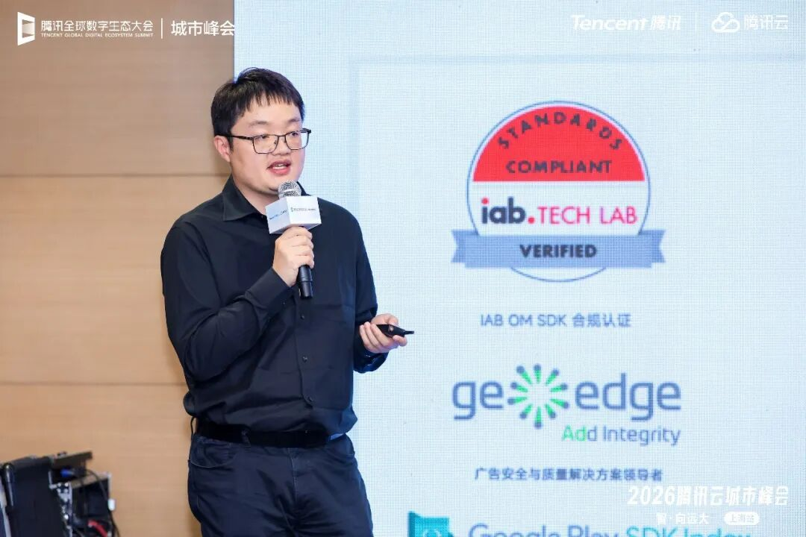

# AI 重构出海竞争力：腾讯云全栈能力为中国企业构建高效、合规底座

> 公众号: 腾讯云出海服务
> 发布时间: 2026-03-31 16:01
> 原文链接: https://mp.weixin.qq.com/s/6Ug6YL0F3mPJdOPQmdxAFQ

---

3月27日，腾讯云上海城市峰会“腾云出海”沙龙举行，来自政府机构、出海企业等领域的专家，共同探讨数字化、智能化如何重构出海竞争力，助力中国企业从产品出海、服务出海迈向能力出海、生态出海、品牌出海的高质量全球化新阶段。

上海市数字企业出海服务协会秘书长贺仁龙表示，当前数字企业出海已从单点突破转向体系化布局，AI与云计算正成为企业参与全球竞争的核心引擎。上海作为数字经济高地与开放前沿，正持续完善跨境服务体系、优化出海环境，期待与腾讯云等生态主体协同，构建政企联动、平台赋能、生态共建的出海服务新格局，帮助企业破解合规、本地化、技术支撑等共性难题，稳健拓展全球市场。

腾讯云出海生态总经理张林表示，腾讯云长期深耕出海服务领域，依托全球覆盖的云基础设施、全栈 AI 技术、成熟合规体系与开放生态协同，已成为海量中国企业走向世界的核心支撑。从互联网、游戏到跨境电商、文创、金融科技等多元领域，腾讯云持续以稳定、安全、高效的技术服务，陪伴企业从试水海外到深耕本地，从单点布局到全球运营，全方位降低出海门槛、提升运营效能、保障业务安全，成为中国企业出海路上值得信赖的长期伙伴。

AI重塑出海格局：中国模型领跑全球，智能体成增长新引擎

2025年成为中国AI出海质变关键年：中国生成式AI全球市场份额从1%跃升至15%；开源AI模型在OpenRouter周调用量占比达13.7%，Hugging Face下载份额达17.1%，首次超越美国；海外AI应用月活突破15亿，中国AI应用MAU达5.44亿，同比增长超130%。

与此同时，AI出海也进入到全新阶段。张林认为，Agent规模化应用、超本地化AI、合规智能化、生态协同出海等成为这一轮中国企业出海的关键词，这意味着AI从效率工具升级为企业出海的核心竞争力与增长引擎。

但当前企业出海仍面临基础设施部署、合规与监管壁垒、本地化运营、规模增长与变现等多重挑战，亟需稳定、安全、合规、智能的数字底座支撑。

腾讯云依托多年的全球化实践与技术积累，已经构建覆盖全球算力、AI能力、合规服务、生态协同的一站式出海解决方案，成为企业出海的可靠伙伴。

在全球基础设施层面，腾讯云已实现22个地区覆盖、64个运营可用区、3200+全球加速节点、400T带宽储备，设立9大技术支持中心与100+全球技术支持触点，获得400+项国内外权威认证，全面适配GDPR、ISO、SOC等全球主流合规标准，为企业提供低延迟、高稳定、高安全的全球网络与算力支撑。

在技术能力层面，腾讯云以星脉高性能计算网络、高性能计算集群HCC等为底层算力支撑，依托混元大模型与开源模型生态，打造文生文、文生图、文生视频、代码生成、智能体开发、AI内容安全等全栈AI产品矩阵，可直接支撑拟人化 AI 内容生产、AI 视频营销、社交电商运营、跨境智能客服等多元出海场景，为出海企业提供开箱即用的 AI 能力。

针对AI出海的合规需求，腾讯高级法律顾问文含章分享了海外AI监管与合规实战指南。当前全球AI监管趋严，数据合规、知识产权、市场准入成为三大高危风险点。

对此，文含章分享了海外合规实战要点，包括欧盟数据优先本地存储、远程访问视同跨境传输、签署SCC标准合同条款，模型训练数据确保授权溯源、规避盗版数据集，AI生成内容落实水印与标识、建立全流程审核机制等等。

文含章强调，针对这些监管合规中的实际操作，选用合规可控的本土模型，规避第三方模型地域限制与商用风险，腾讯云以全链路合规能力，帮助企业守住出海安全底线。

生态协同+场景落地：AI助力全行业出海提质增效

在本次沙龙上的圆桌论坛，紫讯、PartnerBoost、时代涌现、合合信息等多位腾讯云的出海生态伙伴，分享AI在跨境电商、联盟营销、AIGC商用、多语种文本处理等场景的落地实践，印证AI正全面激活出海效能。

紫讯推出LinkFox Agent，以AI智能体整合跨境电商多个领域数据，新品调研从2-3天缩短至10分钟，帮助卖家从数据“搬运工”升级为业务“决策者”。

PartnerBoost用AI实现海外红人智能筛选、自动化沟通与履约管理，降低品牌获客成本，提升联盟营销效率与转化效果。

时代涌现打造企业级AI数字人员工，覆盖商品设计、视频创意、电商运营，实现AIGC全流程自动化与合规可控，平衡创新与安全。

合合信息以多语种文本智能技术支持52种语言识别，在具体场景中，INTSIG Docflow智能文档Agent让财务处理效率提升超6倍，满足金融、物流等场景合规审计需求。

PPIO MaaS 平台产品专家谢晋分享了具体落地案例。某头部 AI 情感陪伴应用在出海过程中，面临推理成本高、潮汐流量波动大、海外数据合规严苛三大难题。依托腾讯云全球节点、GPU 算力、CLS+COS 日志存储、高性能负载均衡等核心服务，PPIO 为客户搭建了全球分布式 AI 基础设施，通过Serverless GPU 弹性调度与自研推理优化引擎，将TOKEN成本降低60%以上，峰值响应时间稳定在 P99<1.5s，同时实现数据本地化不出境，完美满足 GDPR 等全球合规要求，支撑业务安全高效出海。

在出海营销领域，TopOn CMO 杨雷带来 AI 驱动广告变现的智能化实践分享。依托腾讯云全球基础设施、云计算、大数据与 AI 技术支撑，TopOn打造智能管家、数据报表、收益健康诊断等核心功能矩阵，通过AI 智能管家实现配置异常监控、根因分析与广告策略自动调整，大幅降低人工运维成本，为全球移动应用开发者提供更稳定、高效、合规的广告变现服务，成为广告业务出海的“云端加速器”。

此外，腾讯云出海生态也将提供市场传播、流量扶持、业务轻咨询、生态活动、产品共创、腾讯集团协同六大核心资源，整合跨境电商、通用SaaS、出海文娱、在线支付、在线广告等全生态伙伴，打造出海企业应用层基座，形成“平台+ISV+渠道+本地合规伙伴”的生态化出海模式，降低企业出海门槛，提升全球化运营能力。

面向未来，腾讯云将持续加大全球基础设施与AI技术投入，以云、AI、生态等全链路能力，聚焦企业出海痛点，提供从技术底座、合规保障、AI赋能到生态协同的一站式服务，助力中国数字企业在全球数字化浪潮中把握机遇、行稳致远，实现从走出去到走进去、走上去的跨越式发展。

下方扫码获取腾讯云最新发布的 《AI in ALL：2025企业出海白皮书》 ，了解更多企业出海最佳实践，助您先行一步，智赢全球。

**-END-**

#

# ①[腾云出海，智・胜全球｜腾云出海上海站，共探企业出海智能化新范式！](https://mp.weixin.qq.com/s?__biz=Mzg5NjgyNDMyOQ==&mid=2247487925&idx=1&sn=9e4e378c149b0625f39cd8fea2fbabf5&scene=21#wechat_redirect)

#

# ②[直播预告｜腾讯游戏云技术在线 26 年第一期・GDC 2026 游戏技术前沿特辑来袭！](https://mp.weixin.qq.com/s?__biz=Mzg5NjgyNDMyOQ==&mid=2247487912&idx=1&sn=72603341745e63434f768aef23118680&scene=21#wechat_redirect)

#

# ③[安心“养虾”，腾讯龙虾安全中心来了！](https://mp.weixin.qq.com/s?__biz=Mzg5NjgyNDMyOQ==&mid=2247487904&idx=1&sn=f4de0a00b52d99a30fecab221caf4ec2&scene=21#wechat_redirect)

****关注我，及时获取互联网出海相关的行业趋势、云解决方案、实践案例等最新资讯****