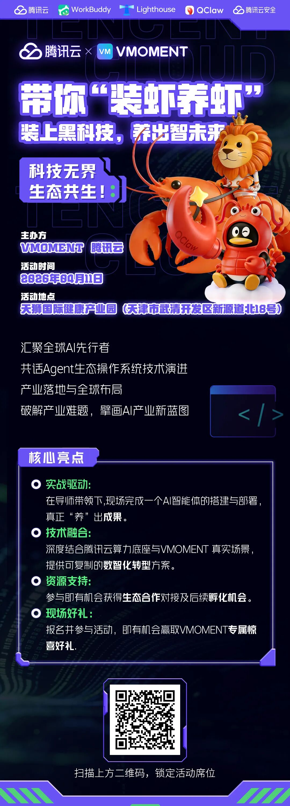

# 腾讯云 × VMOMENT｜龙虾部署实战培训会火热来袭！

> 公众号: 腾讯云出海服务
> 发布时间: 2026-04-03 17:04
> 原文链接: https://mp.weixin.qq.com/s/rdZEY7uXDdX9O7-lm-edLg

---

AI跨入Agent时代，“百虾大战”热火朝天！还在只看不学、只懂理论不会实操落地？ 全球大健康垂直社交电商平台VMOMENT携核心技术VMClaw，重磅联手腾讯云打造龙虾部署实战培训会，手把手带你现场搭建＋部署AI智能体，真正做到“装虾、养虾、应用出成果”！

**四大必冲亮点，干货拉满**

1. 实战驱动：拒绝纸上谈兵，亲手产出可落地的AI智能体成果。

2. 技术融合：深度结合腾讯云算力底座与VMOMENT真实场景，打通技术到场景的最后一公里。

3. 资源支持：参与即有机会获得生态合作对接及后续孵化机会。

4. 现场好礼：报名并参与活动，即有机会赢取VMOMENT专属惊喜大礼。

硬核技术：AI落地，体验下一代数字基建

深度融合腾讯云全栈算力与VMOMENT真实商业场景。扫码报名，直观感受多智能体协同、跨域数据联动解锁 Agent生态操作系统的技术密码，抢占AI时代入口先机。

下方扫码获取腾讯云最新发布的 《AI in ALL：2025企业出海白皮书》 ，了解更多企业出海最佳实践，助您先行一步，智赢全球。

**-END-**

#

# ①[AI 重构出海竞争力：腾讯云全栈能力为中国企业构建高效、合规底座](https://mp.weixin.qq.com/s?__biz=Mzg5NjgyNDMyOQ==&mid=2247487935&idx=1&sn=c1cbf469524e1e9d8f7ff3b051491ca7&scene=21#wechat_redirect)

#

# ②[腾云出海，智・胜全球｜腾云出海上海站，共探企业出海智能化新范式！](https://mp.weixin.qq.com/s?__biz=Mzg5NjgyNDMyOQ==&mid=2247487925&idx=1&sn=9e4e378c149b0625f39cd8fea2fbabf5&scene=21#wechat_redirect)

#

# ③[直播预告｜腾讯游戏云技术在线 26 年第一期・GDC 2026 游戏技术前沿特辑来袭！](https://mp.weixin.qq.com/s?__biz=Mzg5NjgyNDMyOQ==&mid=2247487912&idx=1&sn=72603341745e63434f768aef23118680&scene=21#wechat_redirect)

****关注我，及时获取互联网出海相关的行业趋势、云解决方案、实践案例等最新资讯****