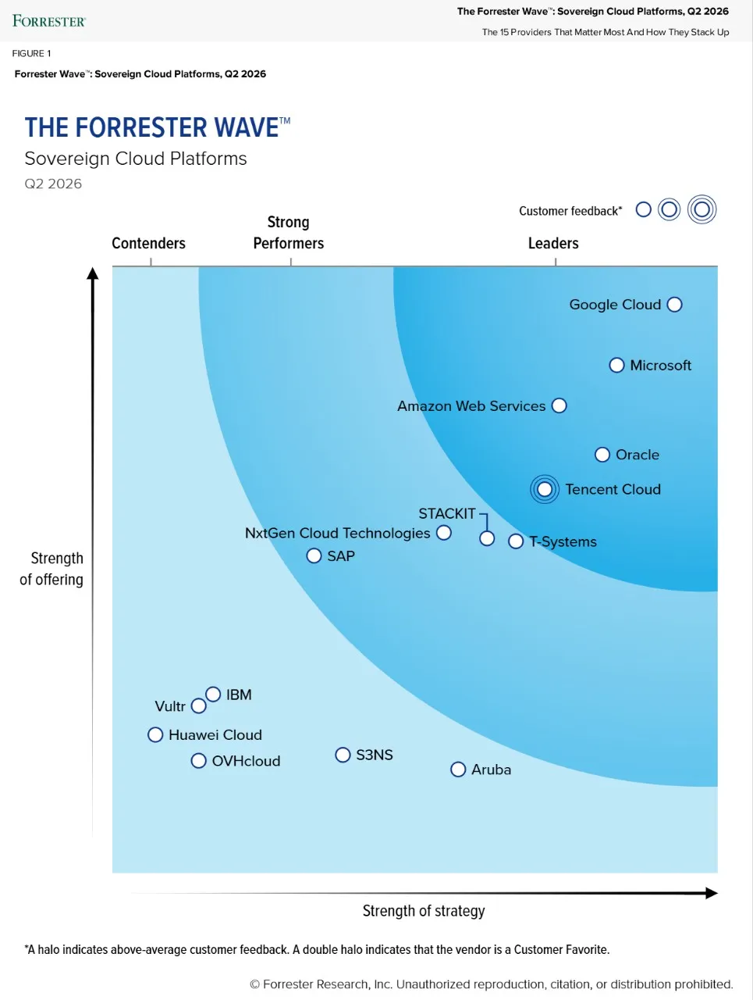
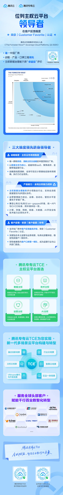

# 全球领导者｜腾讯云凭借专有云TCE跻身《Forrester Wave™：主权云平台》领导者象限

> 公众号: 腾讯云出海服务
> 发布时间: 2026-05-28 18:00:00
> 原文链接: https://mp.weixin.qq.com/s/LKJAihbDwjIcz1XcopIyrQ

---

#

近期，Forrester正式发布首个《Forrester Wave™：主权云平台》报告。报告对全球15家主要云厂商从产品能力、战略维度、客户反馈三个维度进行系统性评估。在全球一众超大规模云厂商中，腾讯云凭借腾讯专有云 TCE 成功入选领导者象限，是报告中唯一一家始终坚守并落地清晰主权云战略的中国超大规模云厂商。
\*Sovereign Cloud（主权云）是起源于海外的纯技术合规概念，其核心是一套在现有云技术架构上叠加的合规与控制标准，以满足企业等主体，对数据控制、访问权限、运营自主的要求。此外，凭借对强监管行业与公共部门独特市场需求的理解，腾讯云在全参评厂商中荣获 “Customer Favorite（客户最爱）” 评价。

---

**为什么是腾讯云？**

在主权数据治理能力评估中，Forrester给出了明确的评语：

腾讯云基于CI/CD标准与统一API服务，实现覆盖公有云与私有化物理隔离环境的全流程管理与多团队协同。其运维管理服务在所有参评厂商中同样表现突出，最终获得 “Remarkable（卓越）” 评级。

这两项能力的叠加，让腾讯云在15家全球云厂商中脱颖而出。

**主权云，正在成为刚需**

主权云正在成为政务、金融等强监管行业数字化转型的核心诉求。随着数据安全法规趋严与企业出海加速，相关行业对于数据驻留、访问控制与运营自主的要求已从可选项升级为刚性门槛。

腾讯云以腾讯专有云TCE提供私有云解决方案。腾讯专有云TCE围绕数据主权、运营主权、技术主权构建全栈式主权云解决方案，并融合前沿AI能力，为客户提供安全合规的数字化转型路径。

**产品能力：全栈统一，多态部署**

腾讯专有云TCE与腾讯公有云同源同构。

这一架构上的统一性，为产品持续投入与迭代提供了有力保障，涵盖计算、存储、网络、数据库、AI能力等全栈云原生基础设施；支持公有云、私有化、混合云及物理隔离（离线）等多种部署形态，可根据客户监管要求灵活适配。

同时，腾讯专有云TCE已将AI能力深度集成至云底座，支持客户在主权合规框架内构建大模型训练、推理及Agent应用，实现 “合规云” 与 “智能云” 的统一落地。

平台内置全方位安全产品组合，涵盖运营安全、终端安全及数据安全，并与海内外主流软硬件厂商保持良好兼容，适配度达100%。客户可自由选择所需硬件与软件，不受限于特定厂商——对于在不同区域及行业中面临多样化硬件合规需求的客户而言，这是突出优势。

腾讯专有云TCE还支持客户从单一区域部署起步，根据实际需求逐步扩展至多个区域及可用区，灵活适配不同阶段的业务规模。

针对不同客户群体，TCE还提供差异化的服务路径。

- 金融机构及政府部门：可按需获得完全本地化的部署服务及集成的PaaS与运营管理产品；
- 电信运营商：可复用现有硬件资源、集成第三方软件，并构建专属的行业云平台对外销售云资源；
- 使用VMware和Nutanix等虚拟化平台的中小型企业：同样能从TCE灵活的商业模式及可扩展的解决方案中获益。

生产级验证：从国有大行到香港银行业纪录

不同监管环境，不同业务规模，腾讯专有云TCE都给出了可交付的答案。

- 某头部国有大行：基于腾讯专有云TCE构建超大规模云平台，纳管节点规模超 8 万，并完成核心银行业务系统的整体迁移。
- 香港富融银行：以腾讯专有云TCE作为核心技术底座完成新一代银行核心系统切换，容器化部署将资源成本降低40%，业务恢复时间（RTO）缩短至30分钟内，6小时内完成150多个子系统迁移——切换速度刷新了香港银行业纪录。
- 某制造业客户：将腾讯专有云TCE平台的使用范围从单一区域扩展至四大区域，通过 “云边协同” 部署模式，实现了跨国业务的顺畅运营，整体运营效率显著提升。
- 澳门财政局：依托腾讯专有云TCE全栈产品构建 “三中心两区域” 双活数据中心架构，支撑智慧财政平台稳定运行。
- 东南亚某头部运营商：基于腾讯专有云TCE构建了对外运营的行业云平台，实现自用与商业化并行的主权云运营模式。

**持续深化，面向未来**

对于腾讯云而言，此次入选Forrester领导者象限，代表了权威第三方对腾讯专有云TCE在国际主权云市场地位的认可。

腾讯专有云TCE 将持续深化主权云核心能力建设，重点推进GPU硬件适配扩展、AI智能体能力丰富及合规性功能强化，助力全球政务、金融等高监管行业客户实现可信、可控的智能化升级。

于腾讯云而言，主权云不是终点，更是一个全新的发展起点。

⬇️⬇️长按或扫描长图二维码，免费获取完整报告⬇️⬇️

下方扫码获取腾讯云最新发布的 《AI in ALL：2025企业出海白皮书》 ，了解更多企业出海最佳实践，助您先行一步，智赢全球。

**-END-**

#

# ①[【直播预约】速览！2026微信小游戏开发者大会议程来了](https://mp.weixin.qq.com/s?__biz=Mzg5NjgyNDMyOQ==&mid=2247487979&idx=1&sn=7891deb0d302e449bc38e6ccea5583c0&scene=21#wechat_redirect)

#

# ②[海外爆火AI“小龙虾”背后的腾讯云底座](https://mp.weixin.qq.com/s?__biz=Mzg5NjgyNDMyOQ==&mid=2247487968&idx=1&sn=242fa2897857b532385c8d58608d844c&scene=21#wechat_redirect)

#

# ③[【直播预约】AI游戏开发避坑实战｜腾讯游戏云技术在线助力独立开发者高效落地](https://mp.weixin.qq.com/s?__biz=Mzg5NjgyNDMyOQ==&mid=2247487963&idx=1&sn=2a4909b1d7c6b7b7714634faeecd27ea&scene=21#wechat_redirect)

****关注我，及时获取互联网出海相关的行业趋势、云解决方案、实践案例等最新资讯****