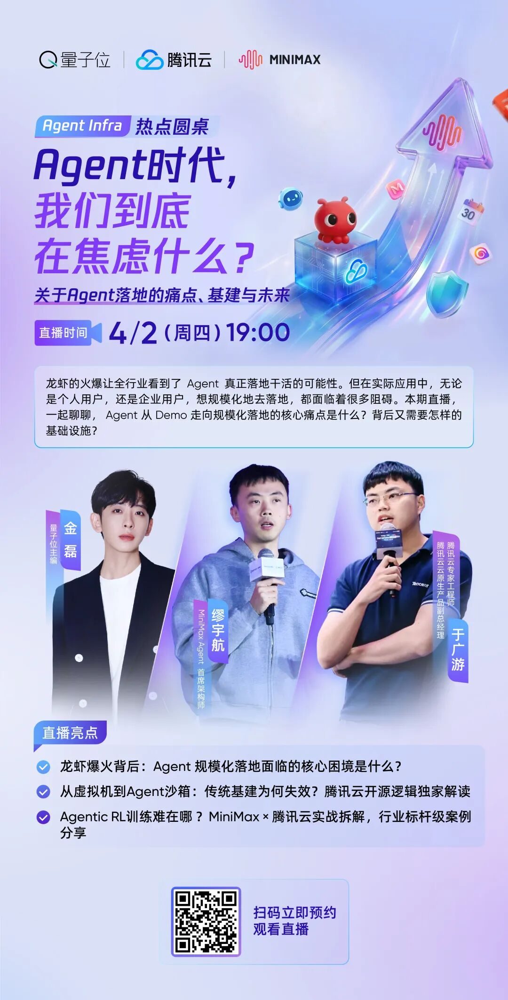

# 腾讯云 X MiniMax｜一场直播，看懂下一代Agent基础设施的打开方式。

> 公众号: 腾讯云原生
> 发布时间: 2026-04-01 14:59:13
> 原文链接: https://mp.weixin.qq.com/s/Q6e3rglAMvmxFCUTd6T94w

---

龙虾爆火背后，Agent 规模化落地面临的核心困境是什么？传统基建为何失效？Agentic RL训练究竟难在哪？

MiniMax Agent首席架构师 x 腾讯云Agent Runtime产品负责人同台共谈，更有行业标杆级Agent落地案例，干货满满～

【图注】这是一张关于“Agent时代，我们到底在焦虑什么？”的直播宣传海报。由量子位、腾讯云和MINIMAX联合举办，直播时间为4月2日（周四）19:00。海报中提到三位嘉宾：量子位创始人金磊、腾讯云智能产品中心总经理缪宇航、腾讯云AI平台部总监于广游。直播亮点包括探讨Agent规模化落地的核心困境、传统基建失效原因及Agent RL训练难点等。海报底部提供了二维码用于预约观看直播。
